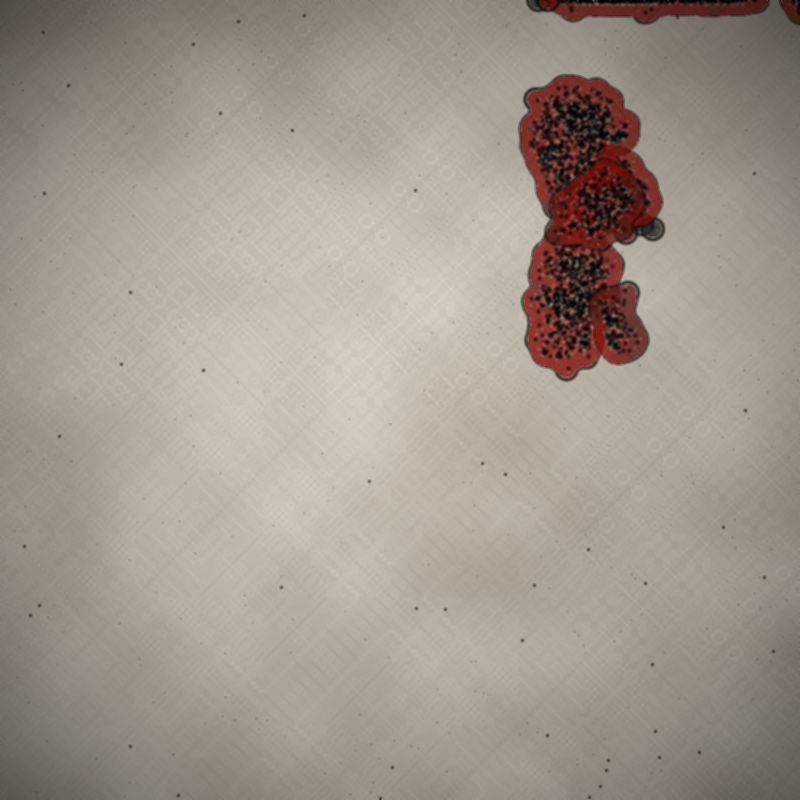

# evo-sim

Open-ended artificial-life sandbox in Swift. Single cells in a 3D chemistry
soup evolve into multicellular creatures with truly emergent morphology —
no body-part templates, no hardcoded biology. The rendered output looks
like transmission electron microscopy: pale slide background, dark
electron-dense bodies with visible internal organelles, real photographic
grain.



## What's actually being simulated

- **3D chemistry field** — a nutrient resource that diffuses through the
  tank and is consumed by cells.
- **3D morphogen field** — a separate signaling chemical cells secrete
  and read. This is the mechanism for breaking body symmetry: lineages
  that establish a useful secretion / response pattern develop localized
  organs.
- **Cells** — soft-body mass-points connected by damped springs (bonds).
  Each cell carries a 16-channel internal state. Continuous brownian /
  cilia jitter keeps the medium alive.
- **Per-organism Neural Cellular Automaton (NCA)** — every cell of an
  organism forward-passes the same small MLP. Inputs: own state, mean
  neighbour state, local nutrient + gradient, local morphogen + gradient,
  mechanical stress. Outputs: Δstate, divide / bud / die signals,
  division direction, bond stiffness, contraction, predation, morphogen
  secretion.
- **Selection** — periodic tournament with split predator-fitness +
  prey-fitness budgets. Fitness terms: survival, motion bias, chemotaxis,
  cumulative predation drained, predator-proximity vs prey-distance.

Nothing about "mouths", "heads", or "limbs" is anywhere in the code.
The genome decides what to secrete, when to divide, when to contract,
when to predate. Visible organs arise (or fail to arise) entirely by
selection on what the random NCAs happen to do.

## Architecture

```
EvoSimCore      simulation engine (platform-agnostic Swift)
EvoSimRender    renderers: MicroscopyRenderer (TEM look),
                RaymarchRenderer, SnapshotRenderer (legacy)
EvoSimAppKit    cross-platform SwiftUI TankView + view model
Apps/EvoSimMac  macOS app (everlasting tank with event loop)
Apps/EvoSimSnapshot   CLI: render PNG / GIF snapshots of evolved tanks
Tests/                26+ unit tests (genome shape, chemistry mass
                conservation, bond stretch, cell-on-cell repulsion,
                predation energy transfer, no-food extinction)
```

The same `EvoSimAppKit` module powers both macOS and a future iOS
target (Package.swift declares both platforms).

## Run

```
swift build -c release
swift run -c release EvoSimMac
```

Then leave it open. The event loop sprinkles food, runs tournament
selection, drops immigrants, drifts the medium current, ages
populations. The camera tracks the largest organism. Click in the tank
to drop a food pellet; ⇧-click to stir; ⌘-click to pluck a cell.

For one-shot renders:

```
.build/release/EvoSimSnapshot \
    --seed 314 --steps 20000 --organisms 30 \
    --food 50 --food-every 160 \
    --select-every 2000 --keep 0.5 \
    --motion-bias 12 --chemotaxis-bias 0.5 \
    --predation-bias 4 --chase-bias 6 \
    --microscopy --follow-largest \
    --gif 250 --gif-delay 0.05 \
    --width 480 --height 480 \
    --out tank.gif
```

## Gallery

- `docs/snapshots/microscopy_v3.png` — early cells with anatomy
- `docs/snapshots/mouth_eats.png` — multilobed body with two
  evolved red mouth regions
- `docs/snapshots/coevo.png` — heavily predator-adapted creature
  under combined motion + predation + chase selection
- `docs/snapshots/mixed_v2.png` — diverse mixed population
- `docs/snapshots/hunters_40k.gif` — 15s clip of long-evolution

## Design commitments (non-negotiable)

These are encoded in `CLAUDE.md`:

1. No body-part library. No code anywhere names "limb", "head", "eye",
   "mouth", etc. Bodies are colonies of cells whose specialisations
   emerge from the developmental program.
2. Genome = developmental program, not blueprint. The NCA's outputs are
   all that drive cell behaviour.
3. Selection acts on whole-organism viability — never on intermediate
   features. The environment does the selecting.
4. Environment is a first-class morphogen. Chemistry, morphogen,
   mechanical stress, neighbours all feed into cell decisions.
5. Energy (cell state channel 0) is physics — NCA can't write to it.

## License

MIT.
